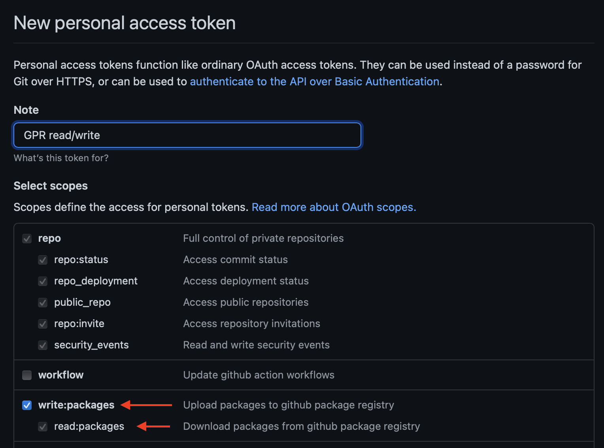

This is a freshly-generated Express app which depends on an npm package hosted on GitHub Packages.

## Local test procedure

1. Install dependencies from a clean slate
    ```sh
    rm -fr node_modules .npmrc && npm cache clear --force && npm install
    ```
   
    1. Notice that `@codertocat/hello-world-npm` failed to install:
   
       ```
       npm ERR! code E404
       npm ERR! 404 Not Found - GET https://registry.npmjs.org/@codertocat%2fhello-world-npm - Not found
       npm ERR! 404
       npm ERR! 404  '@codertocat/hello-world-npm@^1.0.2' is not in the npm registry.
       npm ERR! 404 You should bug the author to publish it (or use the name yourself!)
       npm ERR! 404
       npm ERR! 404 Note that you can also install from a
       npm ERR! 404 tarball, folder, http url, or git url.

       npm ERR! A complete log of this run can be found in:
       npm ERR!     /Users/patrikcsak/.npm/_logs/2021-01-17T17_16_46_858Z-debug.log
       ```

   1. Notice that npm `prepare` script is not run before `npm install`
1. Generate a new GitHub personal access token with `write:packages` and `read:packages` permissions
    
1. Generate `.npmrc`
   ```sh
   GITHUB_TOKEN={{token}} npm run create-npmrc
   ```
1. Install again
    ```sh
    rm -fr node_modules && npm cache clear --force && npm install
    ```
   
   Notice that `npm install` succeeded:

   ```
   ...
   added 100 packages, and audited 101 packages in 6s
   ...
   ```

## Digital Ocean App Platform test procedure

1. Deploy to Digital Ocean

   [](https://cloud.digitalocean.com/apps/new?repo=https://github.com/ptrkcsk/do-app-platform-github-package/tree/main)
   1. Enter `GITHUB_TOKEN` environment variable when prompted
   
1. Notice that the build command (`npm run create-npmrc`) is scheduled to run after `npm install`
1. Notice that npm `prepare` script is not run before `npm install`
   <details>
      <summary>Example log output</summary>
   
      ```
      => Initializing build
      => Retrieving source code to /workspace
      => Checking out commit "8e6ef44f33abc564e1cdba8e3de48de2444a632c"
      => Validating environment

      => Building app using buildpacks
      => Injecting app environment variables:
      GITHUB_TOKEN
      => Configuring custom build command to be run at the end of the build:
      npm run create-npmrc
      => Running buildpack detection

      heroku/nodejs-engine  0.5.0
      digitalocean/node     0.2.0
      digitalocean/procfile 0.0.3
      digitalocean/custom   0.1.0


      => Building app

      ---> Node.js Buildpack
      ---> Installing toolbox
      ---> - jq
      ---> - yj
      ---> Getting Node version
      ---> Resolving Node version
      ---> Downloading and extracting Node v12.20.1
      ---> Parsing package.json
      ---> No file to start server
      ---> either use 'docker run' to start container or add index.js or server.js
      Installing node_modules using npm (from package-lock.json)
      npm ERR! code E404
      npm ERR! 404 Not Found - GET https://registry.npmjs.org/@codertocat%2fhello-world-npm - Not found
      npm ERR! 404
      npm ERR! 404  '@codertocat/hello-world-npm@1.0.2' is not in the npm registry.
      npm ERR! 404 You should bug the author to publish it (or use the name yourself!)
      npm ERR! 404
      npm ERR! 404 Note that you can also install from a
      npm ERR! 404 tarball, folder, http url, or git url.

      npm ERR! A complete log of this run can be found in:
      npm ERR!     /home/apps/.npm/_logs/2021-01-17T20_36_04_270Z-debug.log
      unable to invoke layer creator
      installing node_modules: exit status 1
      ERROR: failed to build: exit status 1
      ! Build failed (145)
      ```
   </details>
